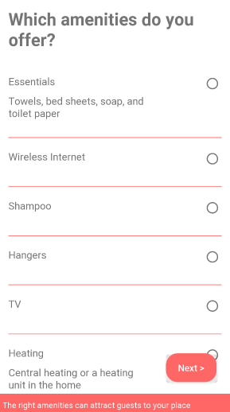
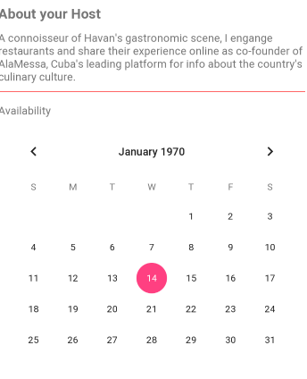
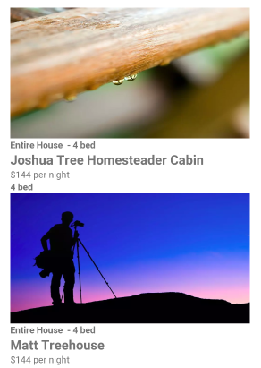
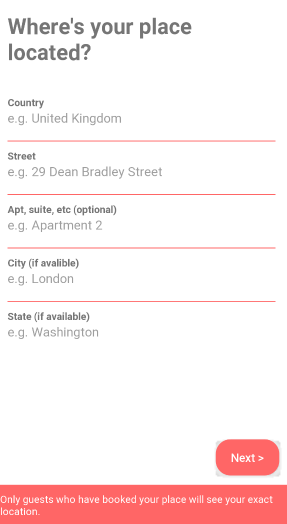
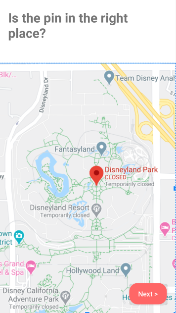
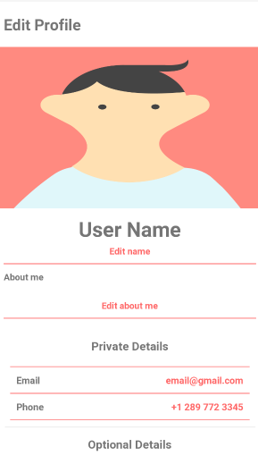
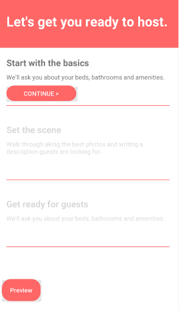

# Airbnb
Replication of Airbnb's android application.

## Prerequisites
* Java Development Kit (JDK)
* Android Studio 
* Node.js
* Express framework, downloaded with npm (package manager for Node.js)
* MySQL 

## Built With
* Android Studio/Java - For building the application
* Node.js/Express - For creating the API so the application and the database can interact
* MySQL - Database

## Starting It
1. After cloning the project, replace the IP in `RetrofitUtil.class` with your own IP. Which can be retrieved by typing
`ipconfig` in the cmd prompt.
This will give you the ability to make the API calls.
2. Build the schema in `MYSQL` with `export_file.sql`.
2. Clone the [Airbnb-API](https://github.com/mattfrancis888/Airbnb-API)
4. Connect the API and the database together by finding the location of the `app.js` file. Once found, go to the cmd prompt and 
type `node app.js` to start up the API.

## Images

  

